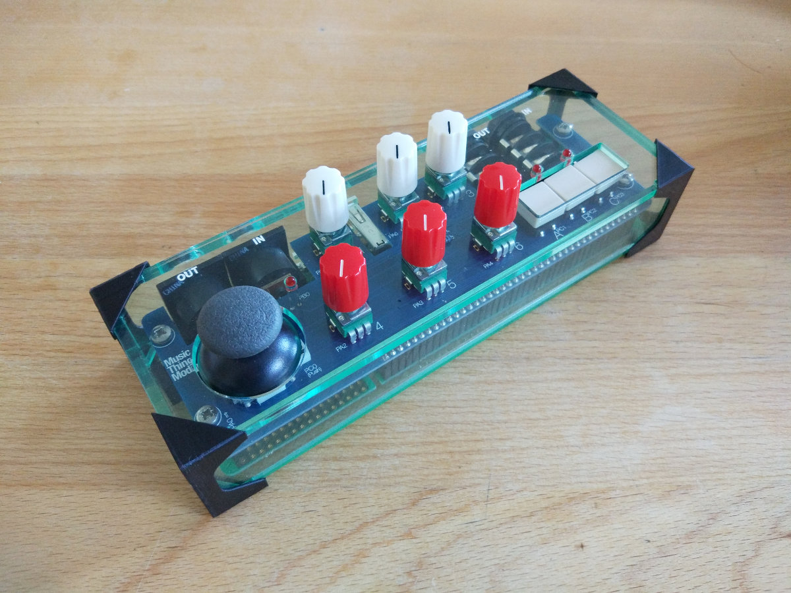
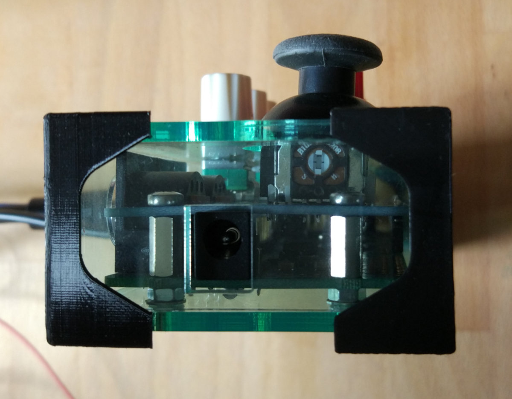

## Axoloti Control Case

This is an enclosure for an [Axololti](http://www.axoloti.com/) audio board and an [AxoControl](https://github.com/TomWhitwell/Axo-Control) control board.

It's designed for laser cutting using **3mm acrylic**. (It won't work with other thicknesses.)

3D printed corner pieces are used to hold the case together. These have ridges which snap into engraved slots in the acrylic panels, to hold everything together.

Holes are provided in the base of the enclosure for M3 bolts which are used to mount the Axoloti Core board.

Included are:

- EPS files for the 6 sides of the acrylic enclosure. These can be used for laser cutting out of 3mm acrylic.
- The original Fusion 360 file for the box corner in .f3d format.
- An .STL file of the box corner which can be used for 3D printing. You will need to print four of these.
 

## Construction Notes - read before building

- Use 3mm acrylic.
- The EPS files have blue RGB(0, 0, 255) lines for cutting, black RGB(0, 0, 0) for text engraving and red lines RGB(255, 0, 0) for engraving deep slots for the corners.
- The red slots in the top and bottom acrylic panels should be engraved to at least 1mm depth to accommodate the slots in the corner pieces. **1.5mm** depth of engraving is recommended. You may have to experiment on a spare piece of acrylic to achieve the correct engraving depth with your laser cutter settings.
- The black engraving does not need to be deep - just enough depth to retain a layer of paint.
- Most laser-ready acrylic comes with a thin plastic covering. Keep the covering on while cutting/engraving, and paint acrylic paint onto the area with engraved text after lasering. When the paint has dried, remove the plastic covering and wipe off any excess paint.
- The corner pieces have one thicker base side which goes at the bottom, raising the box high enough to acommodate the mounting bolts in the bottom of the case.
- The height of the enclosure is designed for the the Axoloti Core board to sit on M3 nuts, with 10mm standoffs between the Axoloti Core board and the Axo Control board, as illustrated below. Use 4 M3 screws going into the holes in the base of the enclosure, through the nuts and the core board and into the standoffs - and a set of another 4 screwed in  from above, through the AxoControl board into the standoffs.
As you can see in the image I also used washers below the nuts to lift the board to the correct height in the case.

## Disclaimer

 These files are provided in good faith but there is no guarantee of their accuracy or functionality.

 This was an experimental project and you can find more straightforward AxoControl enclosures which use acrylic panels which bolt together, and don't require engraving.

 If you encounter issues building this project let me know and I may update the files accordingly.

## License

 This work is licensed under a <a rel="license" href="http://creativecommons.org/licenses/by-nc-sa/3.0/">Creative Commons Attribution-NonCommercial-ShareAlike 3.0 Unported License</a>.
That means that you're free to use the project with attribution, except for commercial purposes, and you should share any remixes or modifications using the same license.
